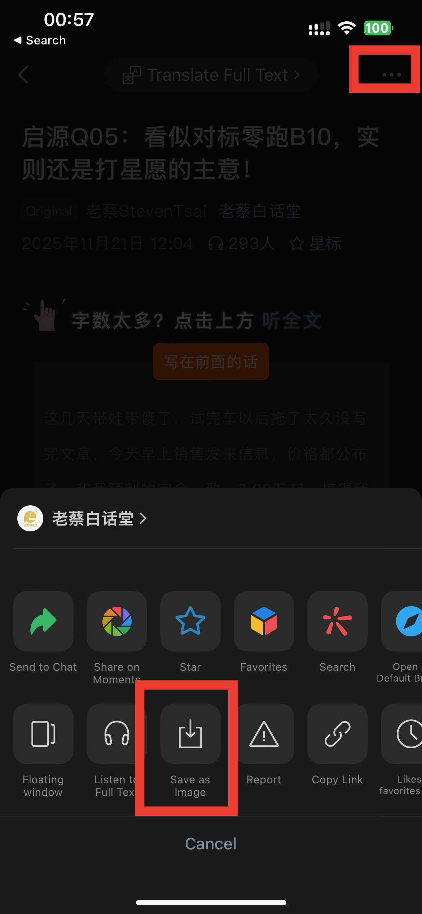
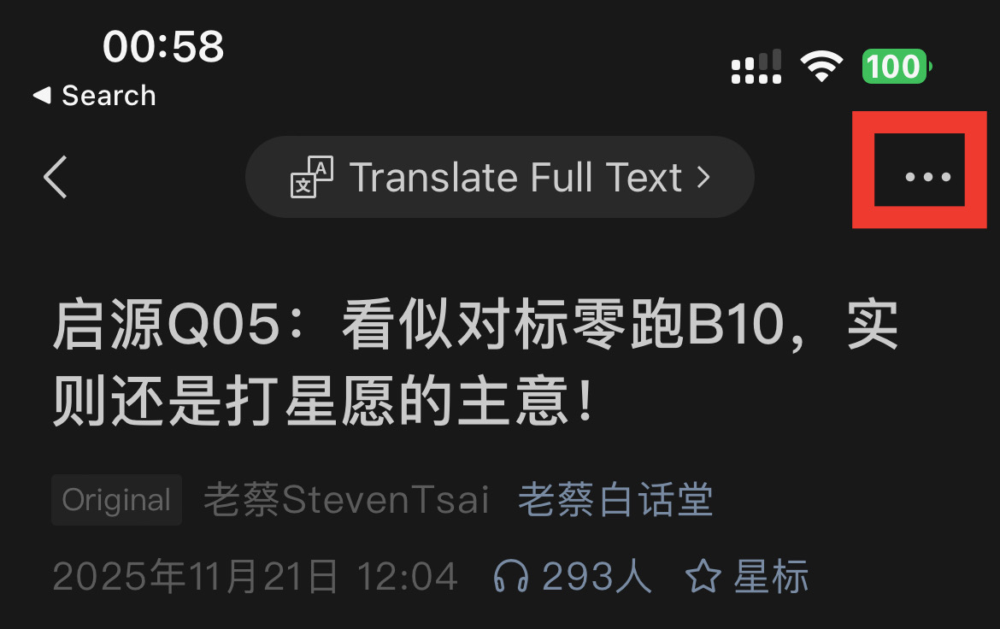

# WeChat Collage Splitter

A small Python tool for splitting WeChat screenshot collages into individual image tiles using visible separator bars.

This tool is intended for images exported from WeChat, where the collage is separated by narrow horizontal and vertical lines. It automatically detects separator color, removes left/right theme bars, and saves unique cropped images.

## Features

- Detects separator bars automatically when `--bar-color` is not provided
- Removes left/right theme bars from WeChat screenshots before cropping
- Splits both horizontal and vertical separators into individual crop regions
- Removes duplicate crops by content hash
- Allows skipping small/thin crops using configurable size thresholds

## Files

- `split_collage.py` — main Python script
- `requirements.txt` — Python dependencies
- `.gitignore` — repository ignore rules

## Requirements

- Python 3.10+ (tested with Python 3.14)
- `Pillow>=10.0.0`
- `numpy>=1.27.0`

Install dependencies:

```bash
python -m pip install -r wechat_image_splitter/requirements.txt
```

## Usage

Run the tool on a single image or a directory of images:

```bash
python wechat_image_splitter/split_collage.py <input-path> --output <output-folder>
```

### Example

Split the WeChat collage image `IMG_2387.JPG` into a folder, skipping small crops:

```bash
python wechat_image_splitter/split_collage.py/IMG_2387.JPG \
  --output results_2387_run1 \
  --min-width 300 \
  --min-height 300 \
  --thin-action skip
```

Split the WeChat collage image `IMG_2389.JPG` into a folder, skipping small crops:

```bash
python wechat_image_splitter/split_collage.py/IMG_2389.JPG \
  --output results_2389_run1 \
  --min-width 300 \
  --min-height 300 \
  --thin-action skip
```

## Command-line options

- `input` — input image file or directory
- `--output` — output directory for cropped images (default: `results`)
- `--bar-color` — optional hexadecimal separator color like `191919` or `#191919`
- `--tolerance` — color tolerance for separator matching (default: `3`)
- `--min-width` — minimum width in pixels for saved crops (default: `300`)
- `--min-height` — minimum height in pixels for saved crops (default: `300`)
- `--thin-action` — action for crops smaller than the size thresholds: `save` or `skip` (default: `skip`)

> Note: the default values are `--min-width 300`, `--min-height 300`, and `--thin-action skip`.

## Output

The tool saves unique cropped images in the specified output directory. If `--thin-action skip` is used, crops smaller than both thresholds will not be saved.

## Screenshots





